# Architecture — Simplified LiteLLM on GCP

A visual, detailed walk-through of the deployed system: every component, how they
connect, what a request touches end-to-end, where state lives, and the security
model (both the GCP layer and LiteLLM's own auth). LiteLLM-specific behavior is
grounded in the LiteLLM docs and linked inline.

> Companion docs: [`DESIGN_DECISIONS.md`](./DESIGN_DECISIONS.md) (why each choice),
> [`PRODUCTION_READINESS.md`](./PRODUCTION_READINESS.md) (scale/resiliency target),
> [`UPDATING.md`](./UPDATING.md) (version upgrades),
> [`../terraform/README.md`](../terraform/README.md) (deploy/usage).

---

## 1. System context

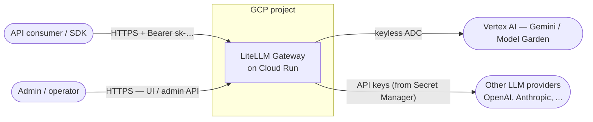

The gateway is an **OpenAI-compatible** front door: clients call
`/v1/chat/completions` (and friends) with a bearer key; LiteLLM authenticates,
rate-limits, routes to a backing model deployment, and returns the response —
while tracking spend and emitting telemetry. Vertex AI is the primary backend
and is reached **keyless via the runtime service account (ADC)**.

---

## 2. Component & deployment architecture

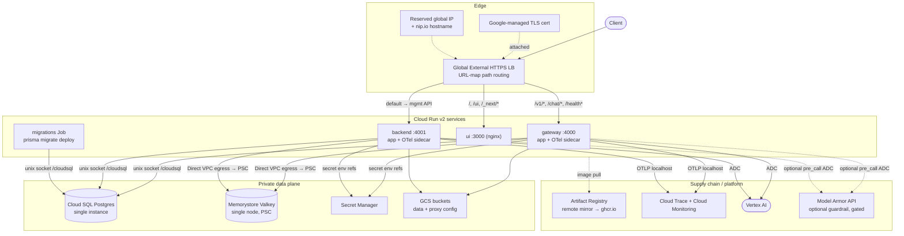

ASCII overview (⚠ = single point of failure in the simplified build):

```
                 Client
                   │ HTTPS (TLS via nip.io or your domain)
        ┌──────────▼───────────┐
        │  Global HTTPS LB      │  80 → 301 → 443
        │  URL-map path routing │
        └───┬──────┬──────┬─────┘
       /v1/*│ /,/ui│ default (mgmt API)
        ┌───▼──┐┌──▼──┐┌──▼────┐
        │gateway││ ui  ││backend│   Cloud Run v2 (each app + OTel sidecar)
        │:4000  ││:3000││:4001  │   ingress = INTERNAL_LOAD_BALANCER
        └─┬───┬─┘└─────┘└─┬───┬─┘
   socket │   │ Direct VPC │   │
  /cloudsql   │  egress→PSC│   │ secret env
        ┌─────▼─┐   ┌──────▼┐  ┌▼──────────┐
        │CloudSQL│  │Valkey │  │SecretMgr  │   ⚠ single instance / single node
        │Postgres│  │(cache)│  │(secrets)  │
        └────────┘  └───────┘  └───────────┘
   egress → Vertex AI (ADC, keyless) · Model Armor sanitize API (optional, ADC)
   egress → OTLP → Cloud Trace/Monitoring
   images ← Artifact Registry remote mirror ← ghcr.io/berriai
```

---

## 3. The three services + path routing

LiteLLM's upstream split into three roles; the LB URL map fans traffic to them:

| Role | Port | Handles | Runtime SA |
|---|---|---|---|
| **gateway** | 4000 | LLM data plane — `/v1/chat/*`, `/v1/completions`, `/v1/embeddings`, `/v1/models`, `/health*`, provider passthroughs, … | `runtime` |
| **backend** | 4001 | Management/control plane — `/key/*`, `/user/*`, `/team/*`, model CRUD, UI login API (default route) | `runtime` |
| **ui** | 3000 | Static admin dashboard (nginx) — `/`, `/ui`, `/_next/*`, assets | `ui_runtime` (no IAM) |

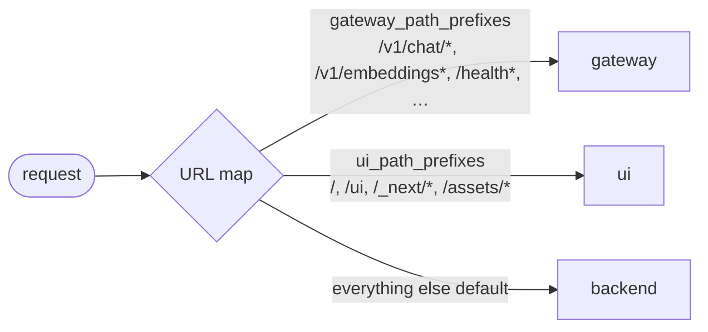

Routing lists live in `terraform/locals.tf` (`gateway_path_prefixes`,
`ui_path_prefixes`) and mirror the upstream Helm ingress. GCP caps a path rule at
10 globs, so gateway prefixes are chunked into rules of 10.

---

## 4. Inside a Cloud Run instance

Each gateway/backend instance runs **two containers** plus mounted volumes. The
app talks to the OTel collector over localhost; the collector authenticates to
GCP with the instance's service account.

```
Cloud Run instance  (gateway revision)                    SA: runtime
┌───────────────────────────────────────────────────────────────────┐
│  container: app  (litellm-gateway)          [ingress port :4000]    │
│  ────────────────────────────────────────────────────────────────  │
│   env (secret_key_ref → Secret Manager):                            │
│      LITELLM_MASTER_KEY, DATABASE_URL, [LITELLM_LICENSE]            │
│   env (plain): REDIS_HOST/PORT, REDIS_SSL=false, GCS_BUCKET_NAME,   │
│      OTEL_EXPORTER=otlp_http, OTEL_ENDPOINT=http://localhost:4318,  │
│      OTEL_ENVIRONMENT_NAME, USE_OTEL_LITELLM_REQUEST_SPAN=true, …   │
│   volume  /cloudsql          → Cloud SQL Auth Proxy unix socket     │
│   volume  /etc/litellm/config.yaml  → GCS (gcsfuse, read-only)      │
│                                                                     │
│        │ OTLP (localhost:4318)                                      │
│        ▼                                                            │
│  container: collector  (otelcol-google)   [:4317/:4318, health :13133]│
│   volume  /etc/otelcol-google/config.yaml → Secret Manager (mounted)│
│   exporters: googlecloud (traces) · googlemanagedprometheus (metrics)│
│                                                                     │
│  container-dependencies:  app  →  collector   (app starts after     │
│                                    collector is healthy)            │
└───────────────────────────────────────────────────────────────────┘

UI instance runs one nginx container under `ui_runtime` (a zero-IAM SA) — no DB,
cache, secret, or VPC access.
```

Key points:
- **DATABASE_URL / master key are injected as secret env** (Secret Manager
  `secret_key_ref`) — never on disk, never in the image.
- **Cloud SQL is a unix socket** (`/cloudsql/<conn>`), mounted by Cloud Run's
  native connector — no VPC path needed for the DB.
- **`proxy_config` (config.yaml)** is mounted read-only from GCS via gcsfuse; a
  content hash forces a new revision when it changes.

---

## 5. Network topology & data paths

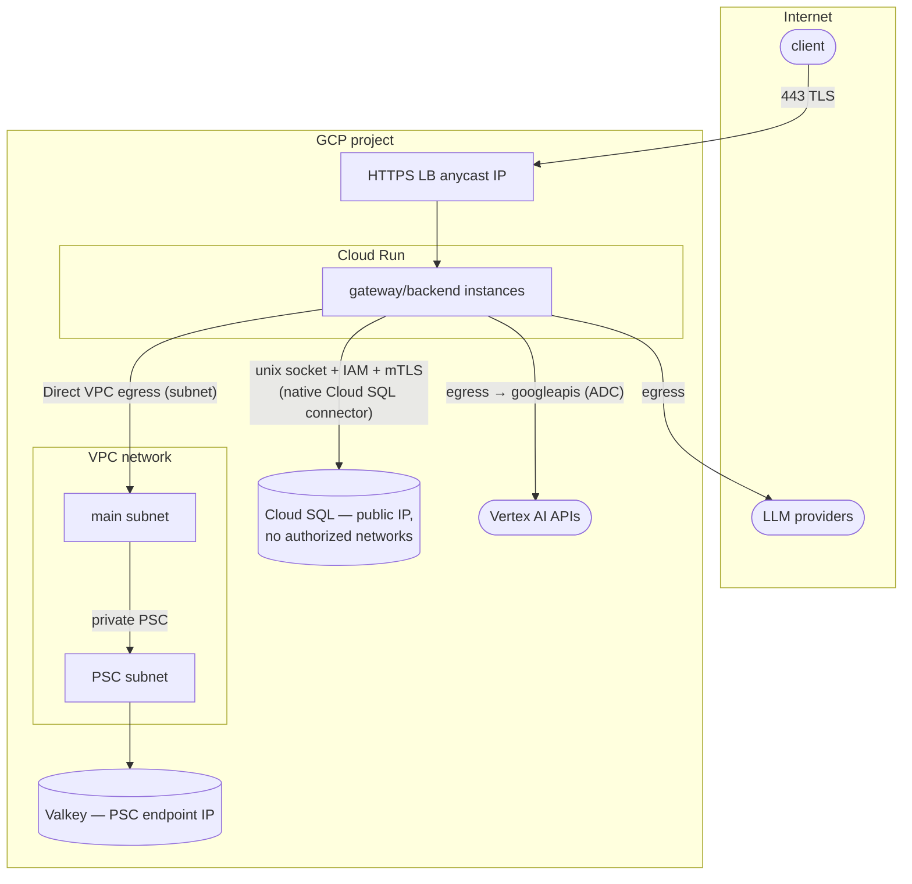

| Path | Transport | Auth | Exposure |
|---|---|---|---|
| Client → LB | HTTPS/HTTP2 (TLS) | LiteLLM bearer key (app layer) | Public IP / nip.io host |
| LB → Cloud Run | Google front-end | `run.invoker` (allUsers) — real gate is the app | Ingress = internal-LB only (raw `*.run.app` blocked) |
| Cloud Run → Cloud SQL | Unix socket via Auth Proxy | **IAM (`cloudsql.client`) + ephemeral mTLS** | DB public IP but **no authorized networks** → not internet-reachable |
| Cloud Run → Valkey | TCP over **Direct VPC egress → PSC** | none (AUTH disabled on private path) | Private PSC IP only |
| Cloud Run → Vertex AI | HTTPS to googleapis | **ADC (runtime SA), keyless** | Google network |
| Cloud Run → other providers | HTTPS egress | provider API key (Secret Manager) | Public egress (`PRIVATE_RANGES_ONLY` routes only private via VPC) |

Details in `terraform/network.tf`, `cloudsql.tf`, `valkey.tf`, `cloudrun.tf`.

---

## 6. Request lifecycle — tracing a chat completion

What a `POST /v1/chat/completions` touches, end to end. Note this shows the
*request path*, not a single distributed trace: in Cloud Trace the LiteLLM
app spans form their own trace, which is **not** joined with the LB/Cloud Run
platform trace (see §10 for the trace-stitching limitation).

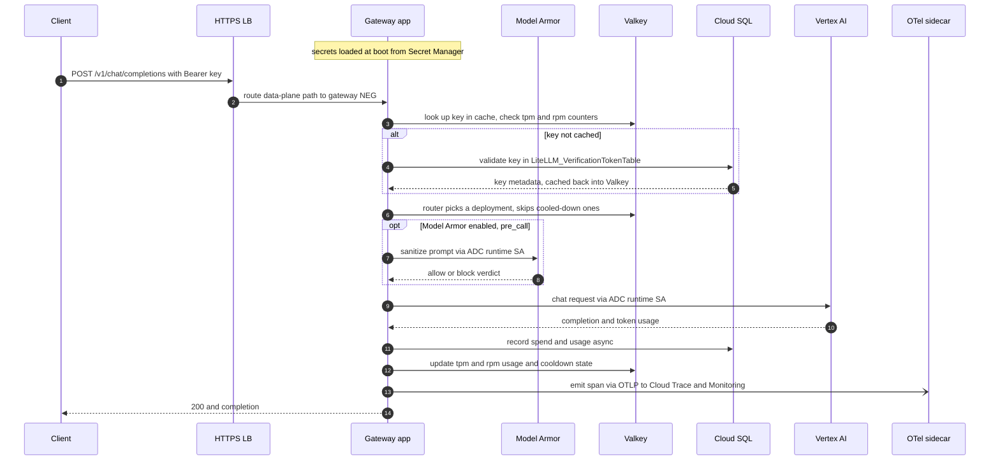

Step notes (grounded in LiteLLM docs):
- **Auth (steps 3–5):** the bearer token is looked up in the
  `LiteLLM_VerificationTokenTable`; the proxy checks blocked/expired/budget/rate
  limits and that the requested model is in the key's allowed list, then
  proceeds. ([virtual keys](https://docs.litellm.ai/docs/proxy/virtual_keys))
- **Routing & cooldown (step 6):** the Router load-balances across deployments
  of a `model_name` and **quarantines failing ones** (429, >50% failures, or
  401/404/408) via cooldowns; in production it uses **Redis to share tpm/rpm
  usage and cooldown timers across instances**.
  ([routing](https://docs.litellm.ai/docs/routing))
- **Valkey vs Postgres:** Valkey holds the *fast, shared* counters/cooldowns and
  the auth cache; Postgres is the *authoritative* store for keys and the spend
  ledger. (See §7 and [caching](https://docs.litellm.ai/docs/proxy/caching).)
- **Guardrail (optional):** when `enable_model_armor` is set, a **pre_call** check
  sends the prompt to the Model Armor sanitize API (keyless ADC). Under
  `INSPECT_ONLY` it logs findings and continues; under `INSPECT_AND_BLOCK` a
  violation returns an error **before** the model call. Off by default and
  gated — see §8.5.
- **Secret Manager** is touched at **boot** (secret env), not per request.

---

## 7. Where state lives (data architecture)

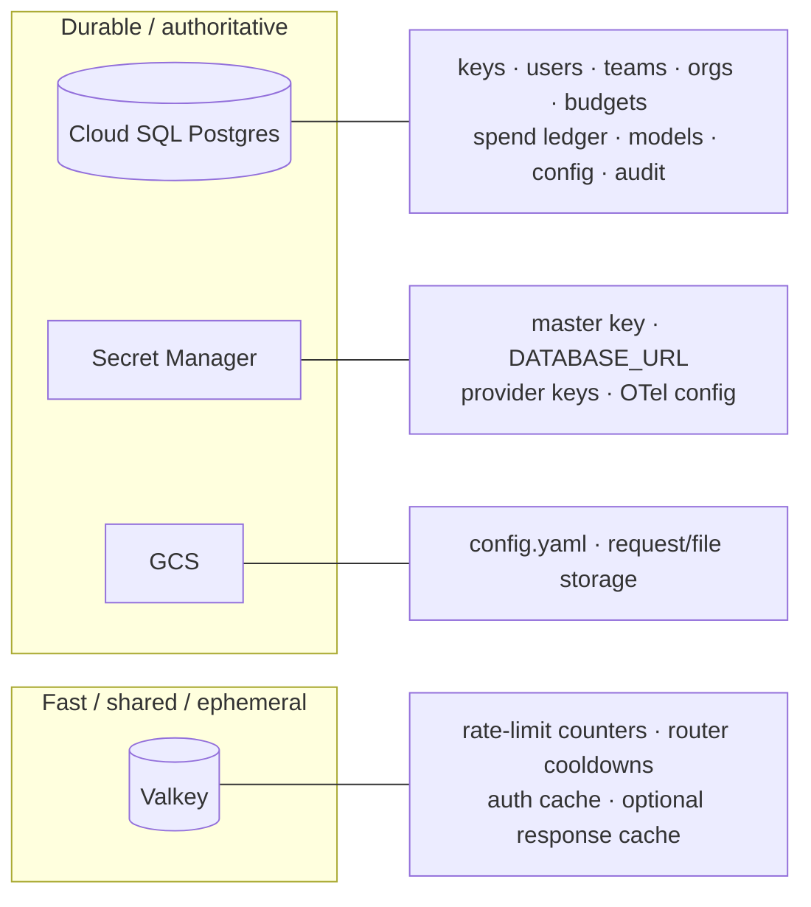

| Store | Role | Contents | If it's lost |
|---|---|---|---|
| **Cloud SQL (Postgres)** | Source of truth | Virtual keys, users/teams/orgs, budgets, spend ledger, DB-stored model config, config, audit | Hard outage — schema-backed features stop |
| **Valkey** | Fast shared cache/coord | tpm/rpm counters, router cooldowns, auth/metadata cache, optional response cache | Degraded — cross-instance rate limiting, cooldowns, caching lost; requests still serve |
| **Secret Manager** | Secrets | master key, `DATABASE_URL`, provider keys, OTel collector config | Boot fails / secret rotation only |
| **GCS** | Object storage | `config.yaml` (proxy config), request/file storage | Config remount / stored files |

### 7.1 Postgres — schema & data model

The schema is owned by **LiteLLM** (Prisma) and created by the `migrations` job
(`prisma migrate deploy`). Every table below is created on deploy; most stay
**empty until you use the corresponding feature**. Core relational model:

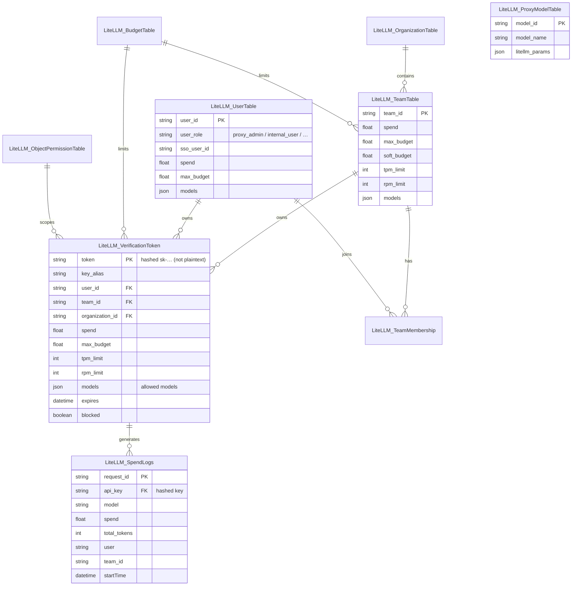

**Table catalog** (grouped; `LiteLLM_` prefix omitted). Core tables are what this
deployment exercises; the rest back enterprise features and are created-but-empty
until enabled.

| Domain | Tables | What they hold |
|---|---|---|
| **Keys / auth** *(core)* | `VerificationToken`, `DeletedVerificationToken`, `DeprecatedVerificationToken`, `JWTKeyMapping` | Virtual keys (hashed token, budget, tpm/rpm, allowed `models`, expiry, blocked), key deletion/rotation audit, JWT-claim→key mappings |
| **Users** *(core)* | `UserTable`, `EndUserTable`, `TeamMembership`, `OrganizationMembership`, `InvitationLink` | Internal users (role, SSO id, spend/budget), external end-users, user↔team/org join rows with per-scope spend |
| **Teams / orgs** *(core)* | `TeamTable`, `DeletedTeamTable`, `OrganizationTable`, `ProjectTable` | Team/org/project groupings with spend, budgets, tpm/rpm, model lists |
| **Budgets** *(core)* | `BudgetTable` | Reusable budget/limit objects shared by keys, users, teams, orgs, tags |
| **Spend / usage** *(core)* | `SpendLogs`, `ErrorLogs`, `DailyUserSpend`, `DailyTeamSpend`, `DailyOrganizationSpend`, `DailyEndUserSpend`, `DailyTagSpend`, `DailyAgentSpend` | Per-request ledger (spend, tokens, model, latency, status) + daily rollups |
| **Model mgmt** *(core)* | `ProxyModelTable`, `CredentialsTable`, `ModelTable`, `HealthCheckTable` | DB-stored models (`STORE_MODEL_IN_DB`), encrypted provider creds, team model aliases, health results |
| **Config** *(core)* | `Config`, `CacheConfig`, `UISettings`, `ConfigOverrides`, `SSOConfig` | Proxy settings (`param_name`→JSON), cache/UI/SSO config |
| **Audit / ops** | `AuditLog`, `CronJob` | Create/update/delete trail (before/after, actor); distributed cron leader-lock |
| **Guardrails / policies** | `GuardrailsTable`, `PolicyTable`, `PolicyAttachmentTable`, `Daily*Metrics`, `ToolTable`, `SearchToolsTable` | Guardrail/policy definitions, attachments, daily metrics, tool registry |
| **MCP** | `MCPServerTable`, `MCPToolsetTable`, `MCPUserCredentials`, `MCPUserEnvVars` | Model Context Protocol servers/toolsets + per-user BYOK creds |
| **Agents / access** | `AgentsTable`, `ObjectPermissionTable`, `AccessGroupTable` | Agents, the shared permission object (models/MCP/agents/tools), access groups |
| **Files / vector stores** | `ManagedFileTable`, `ManagedObjectTable`, `ManagedVectorStore*` | Files, batch/fine-tune jobs, vector stores |
| **Misc / beta** | `SkillsTable`, `PromptTable`, `MemoryTable`, `UserNotifications`, `TagTable`, `WorkflowRun/Event/Message`, `AdaptiveRouter*`, `ClaudeCodePluginTable` | Skills, versioned prompts, memory, tags, workflows, adaptive-routing state |

Notes:
- **Keys are stored hashed** in `VerificationToken` — never plaintext.
- **Models set two ways:** entries in `proxy_config`/`config.yaml` are loaded from
  the mounted file (not in the DB); models added via UI/API persist in
  `ProxyModelTable` because `STORE_MODEL_IN_DB=true` on the backend. LiteLLM
  merges both at runtime.
- **Spend** is written to `SpendLogs` per request and rolled up into the
  `Daily*Spend` tables for reporting.

### 7.2 Valkey (Redis) — contents & usage

Valkey holds only **ephemeral, TTL'd, shared** state — never a source of truth.
LiteLLM uses a **DualCache** (in-process memory + Redis) so hot data is local but
consistent across instances. What lives here:

| Purpose | What's stored | Grounding |
|---|---|---|
| **Rate limiting** | tpm/rpm counters per api-key / user / team / end-user, in per-minute windows (via `redis.incr` / `mget`) | routing / parallel limiter |
| **Router cooldowns + usage** | per-deployment cooldown timers and tpm/rpm usage, shared so all instances agree which deployments are quarantined | [routing](https://docs.litellm.ai/docs/routing) |
| **Auth cache** | virtual-key/user/team auth objects, mirrored to Redis when `enable_redis_auth_cache: true` so replicas share cached auth instead of each hitting Postgres | [caching](https://docs.litellm.ai/docs/proxy/caching) |
| **Response cache** *(opt-in)* | cached LLM responses keyed on model + messages + params (+ provider params); TTL default or per-request; types: redis, redis-/valkey-/qdrant-semantic, s3/gcs, local | [caching](https://docs.litellm.ai/docs/proxy/caching) |

Per-request cache controls: `ttl`, `no-cache`, `no-store`, `namespace`. Health
via `/cache/ping`, purge via `/cache/delete`.

**In this deployment:** `REDIS_HOST/PORT` are wired, so **rate limiting and the
router use Valkey automatically**. **Response caching** and
`enable_redis_auth_cache` are **opt-in** via `proxy_config` (`litellm_settings`).
Flushing Valkey is non-destructive — it only resets counters/cooldowns/cache
(degraded until repopulated), because durable state is in Postgres.

---

## 8. Security model

Defense in depth across three layers: **transport/edge**, **LiteLLM
application auth**, and **GCP IAM/identity**.

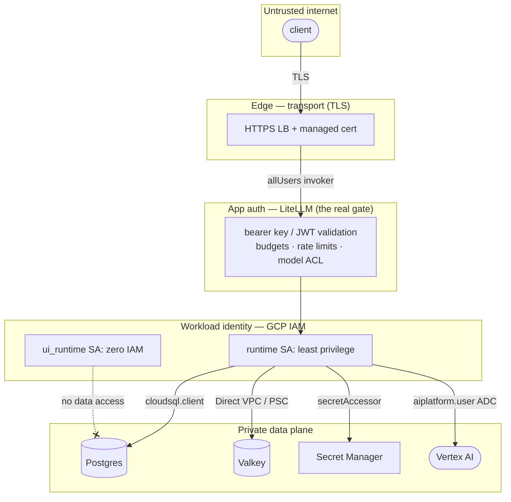

### 8.1 Transport / edge
- **TLS** by default (Google-managed cert via nip.io, or your domain); port 80
  redirects to 443. (`terraform/load_balancer.tf`)
- Cloud Run services are `INGRESS_TRAFFIC_INTERNAL_LOAD_BALANCER` — the raw
  `*.run.app` URLs are not reachable; traffic must come through the LB.
- The `run.invoker = allUsers` binding only opens Cloud Run's gate so LB traffic
  reaches the container; **the real authentication is the LiteLLM key** below.
  (Hardening to IAP/SSO at the edge: `PRODUCTION_READINESS.md` §4.5.)

### 8.2 LiteLLM application auth  *(grounded in docs)*
- **Two-tier keys:** the **master key** (`LITELLM_MASTER_KEY`, `sk-…`) is the
  admin credential; **virtual keys** are minted from it via `/key/generate` and
  stored in the **`LiteLLM_VerificationTokenTable`**. Distribute virtual keys to
  consumers, not the master key.
  ([virtual keys](https://docs.litellm.ai/docs/proxy/virtual_keys))
- **Hierarchy & controls:** keys → users → teams (→ orgs), each with
  `max_budget`, `tpm_limit`/`rpm_limit`, and **model access lists**. Requests
  over budget or outside the allowed models are rejected.
- **Request validation:** extract bearer token → look up key → check
  blocked/expired/budget/rate → verify model is allowed → proceed.
- **Admin UI / SSO:** UI login uses `UI_USERNAME`/`UI_PASSWORD` if set, else
  falls back to the master key. For SSO, LiteLLM supports **JWT/OIDC**
  (`enable_jwt_auth`, `JWT_PUBLIC_KEY_URL`) with **Google** as a provider; the
  `litellm_proxy_admin` scope grants admin, and roles include `proxy_admin`,
  `internal_user`, `internal_user_view_only`. Admins reach `/team/*`, `/key/*`,
  `/user/*`; teams reach the OpenAI routes.
  ([token auth](https://docs.litellm.ai/docs/proxy/token_auth))

> **In this simplified deploy:** the **master key is the active gate** (no
> virtual keys minted yet, SSO not configured). UI login falls back to the master
> key unless `ui_password` is set. Enabling virtual keys/teams/SSO is the
> production step — no infra change needed, it's LiteLLM config + a DB that's
> already present.

### 8.3 GCP IAM / workload identity  (`terraform/iam.tf`)
- **`runtime` SA** (gateway/backend/job) — least privilege:
  `roles/cloudsql.client`, `secretmanager.secretAccessor` (per secret),
  `storage.objectAdmin` (data bucket), `cloudtrace.agent` +
  `monitoring.metricWriter` (the OTel sidecar), and `aiplatform.user` (Vertex,
  when `enable_vertex_ai`).
- **`ui_runtime` SA** — **no IAM bindings at all**; a compromised static-UI
  container can't reach DB/cache/secrets via the metadata server.
- **Vertex is keyless:** LiteLLM authenticates with **ADC = the runtime SA**, so
  no service-account key files exist anywhere.
- **Cloud Run service agent** gets `artifactregistry.reader` on the mirror to
  pull images (`terraform/artifact_registry.tf`).

### 8.4 Data-plane isolation
- Cloud SQL: public IP but **no authorized networks** → reachable only through
  the IAM+mTLS Auth Proxy, not the internet.
- Valkey: **private PSC endpoint** only, reached via Direct VPC egress.
- Secrets: injected as **secret env** (`secret_key_ref`); never in images/state
  values on disk. (State-backend hardening: `PRODUCTION_READINESS.md` §4.7.)

---

### 8.5 LLM guardrails (Model Armor) — optional, GCP-first

When `enable_model_armor` is set, LiteLLM's native **Model Armor** guardrail runs
inside the gateway/backend (pre_call by default): it calls the Google Cloud Model
Armor sanitize API (keyless **ADC** via the runtime SA + `roles/modelarmor.user`)
to screen for **prompt injection/jailbreak, PII/SDP, and malicious URLs**. Default
`INSPECT_ONLY` (observe + log, don't block) and `fail_on_error=false` so it never
breaks traffic. Findings surface as Cloud Logging `SanitizeOperation` entries and
as `modelarmor.googleapis.com/template/*` counts on the dashboard. Applied globally
(`default_on`) or per request (`guardrails: ["model-armor"]`) — LiteLLM has no
percentage sampler. See [`LIMITATIONS.md`](./LIMITATIONS.md) for the filter-version
provider gap and the enterprise-only Prometheus metrics path.

## 9. Boot & deploy sequence

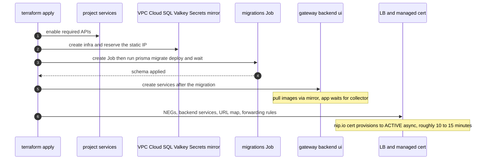

Ordering guarantees: services `depend_on terraform_data.migration`, so they never
go live against an un-migrated schema; the nip.io hostname is derived from the
reserved IP so the cert is issued in the same apply (see
[`UPDATING.md`](./UPDATING.md) and `DESIGN_DECISIONS.md`).

---

## 10. Observability / telemetry flow

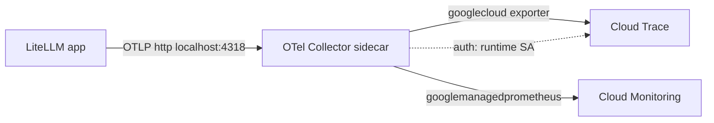

The collector runs as a sidecar on gateway + backend, receives OTLP on
localhost, and exports **traces → Cloud Trace** and **metrics → Cloud
Monitoring (Managed Prometheus)** using the runtime SA
(`roles/cloudtrace.agent`, `roles/monitoring.metricWriter`). Tracing is verified
working on the default **`v1.89.2`** image: a chat request produces a nested
app-level trace in Cloud Trace (`/v1/chat/completions` → `Received Proxy Server
Request` → `auth`, `proxy_pre_call`, `router`, `litellm_request`, `postgres`,
`batch_write_to_db`). The older `v1.86.0-dev` image did **not** emit — a version
fix, not a config one.

**Trace-stitching limitation (full stack).** The LiteLLM app trace is a *separate*
trace from the Cloud Run/GFE (load balancer) platform request trace: LiteLLM
starts its own trace id and does not adopt the incoming `X-Cloud-Trace-Context`,
so Client → LB → Cloud Run → app is **not** one joined trace. Joining them needs a
Google trace-context propagator (W3C `traceparent` vs Google's header;
`opentelemetry-propagator-gcp` — upstream
[#22762](https://github.com/BerriAI/litellm/issues/22762)). Within the gateway the
app spans *are* correctly nested into one trace. Note also that the
**gateway→backend** hop is the control plane (not in the chat data path, so no
cross-service spans to stitch) and downstream **Vertex AI / Cloud SQL** are not
traced into the app trace (the `litellm_request` / `postgres` spans are
client-side timings). See [`LIMITATIONS.md`](./LIMITATIONS.md).

---

## 11. Image supply chain

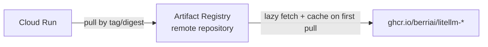

Cloud Run cannot pull `ghcr.io` directly, so the module creates an AR **remote
repository** that lazily mirrors and caches the four `litellm-*` images. Every
project gets its own mirror on apply — no `docker pull/push`. Digest pinning and
Binary Authorization are the hardening steps (`UPDATING.md` §5,
`PRODUCTION_READINESS.md` §4.5).

---

## 12. Failure modes & blast radius (simplified build)

| Failure | Effect | Roadmap fix |
|---|---|---|
| **Valkey down** | No cross-instance rate limiting / cooldowns / cache; requests still serve (degraded, less safe) | Sharded cluster + replicas (§4.3) |
| **Cloud SQL down** | Auth/spend/model-config unavailable → hard impact | REGIONAL HA + replicas (§4.2) |
| **One zone fails** | DB + cache are single-zone → outage | Multi-zone HA (§4.2–4.3) |
| **Region fails** | Whole stack down (single region) | Multi-region active-active (§4.8) |
| **A model deployment errors** | Router cools it down, routes to others / fallbacks | Already handled by LiteLLM |
| **New revision unhealthy** | Cloud Run keeps last-good revision serving | Canary + rollback (§4.1, UPDATING §6) |
| **TLS cert provisioning window** | ~10–15 min after fresh apply, HTTPS not yet serving | Inherent to managed certs (UPDATING/README) |

---

## 13. Cross-references

- **Why these choices:** [`DESIGN_DECISIONS.md`](./DESIGN_DECISIONS.md)
- **Scale/resiliency/security roadmap:** [`PRODUCTION_READINESS.md`](./PRODUCTION_READINESS.md)
- **Version upgrades:** [`UPDATING.md`](./UPDATING.md)
- **Deploy & LiteLLM/Vertex usage:** [`../terraform/README.md`](../terraform/README.md)
- **LiteLLM docs:** [virtual keys](https://docs.litellm.ai/docs/proxy/virtual_keys) ·
  [routing](https://docs.litellm.ai/docs/routing) ·
  [token/JWT auth](https://docs.litellm.ai/docs/proxy/token_auth) ·
  [caching](https://docs.litellm.ai/docs/proxy/caching)
