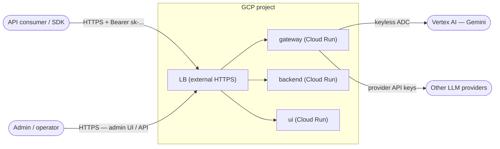
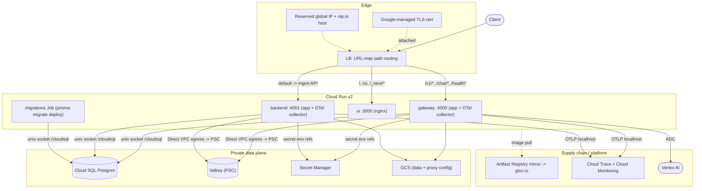
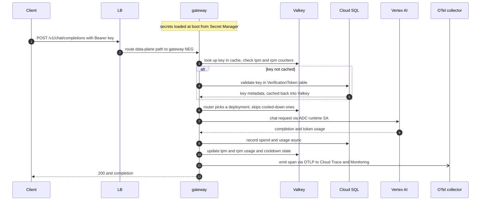
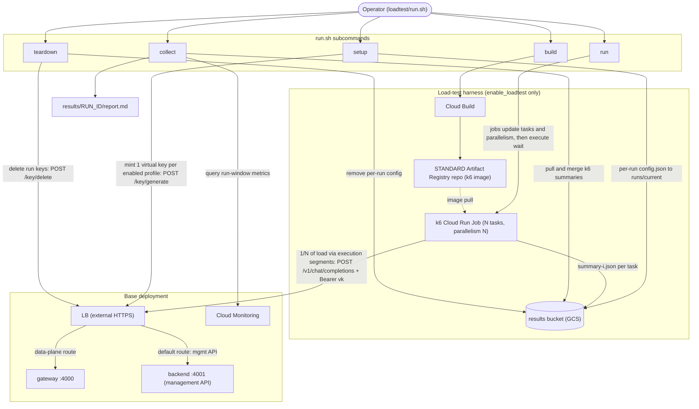

# Overview — Simplified LiteLLM on GCP

A compact, validated visual overview of the deployed system. For the full
reference (network paths, security model, complete data model, failure modes)
see [`ARCHITECTURE.md`](./ARCHITECTURE.md); this file is the fast orientation.

Canonical component names used across every diagram: **gateway**, **backend**,
**ui**, **LB** (external HTTPS load balancer), **Cloud SQL** (Postgres),
**Valkey** (Memorystore), **OTel collector** (sidecar), **Secret Manager**,
**GCS**, **Artifact Registry mirror**, **Vertex AI**.

---

## 1. System context



The gateway is an OpenAI-compatible front door: clients call
`/v1/chat/completions` with a bearer key; LiteLLM authenticates, rate-limits,
routes to a backing model, and returns the response while tracking spend and
emitting telemetry. Vertex AI is the primary backend, reached keyless via the
runtime service account (ADC). All external traffic enters through the LB;
raw `*.run.app` URLs are blocked (ingress = internal load balancer only).

ASCII fallback:

```
  API consumer / SDK          Admin / operator
        |  HTTPS Bearer sk-...       |  HTTPS UI/API
        +------------+---------------+
                     v
              LB (external HTTPS)
             /       |        \
          gateway  backend    ui
             |
     ADC -> Vertex AI ;  keys -> other providers
```

---

## 2. Container / component view



Three Cloud Run v2 services fronted by one LB, plus a migrations Job. The LB
URL map fans traffic by path: LLM data-plane prefixes (`/v1/*`, `/chat/*`,
`/health*`, provider passthroughs) go to **gateway :4000**; UI asset paths
(`/`, `/ui`, `/_next/*`) go to **ui :3000**; everything else (the management
API: `/key/*`, `/user/*`, `/team/*`) defaults to **backend :4001**. gateway and
backend each run the app container plus an **OTel collector** sidecar (app waits
on collector via container-dependencies). **ui** runs a single nginx container
under a zero-IAM service account. Images are pulled through the **Artifact
Registry mirror** that lazily caches `ghcr.io/berriai/litellm-*`.

---

## 3. Request lifecycle — POST /v1/chat/completions



Auth, rate limiting, and routing all consult Valkey first (fast, shared across
instances) and fall back to Cloud SQL for the authoritative key record on a
cache miss. Vertex AI is called keyless with the runtime SA. Spend is written
back to Cloud SQL asynchronously; a span is emitted to the OTel collector, which
exports traces to Cloud Trace and metrics to Cloud Monitoring. (This diagram is
the request path, not one distributed trace — the LiteLLM app trace is separate
from the LB/Cloud Run platform trace; see [`LIMITATIONS.md`](./LIMITATIONS.md).)

---

## 4. Data model — Postgres vs Valkey

| Store | Role | Holds | If lost |
|---|---|---|---|
| **Cloud SQL (Postgres)** | Source of truth | Virtual keys (hashed), users/teams/orgs, budgets, spend ledger (`SpendLogs` + daily rollups), DB-stored models, config, audit. Schema owned by LiteLLM (Prisma), applied by the migrations Job. | Hard outage: auth, spend, and model config unavailable. |
| **Valkey** | Fast shared cache/coord | tpm/rpm rate-limit counters, router cooldowns and usage, auth/metadata cache, optional response cache. All ephemeral and TTL'd. | Degraded only: cross-instance rate limiting, cooldowns, and caching reset; requests still serve. |

Secrets (master key, `DATABASE_URL`, provider keys, OTel config) live in
**Secret Manager** and are injected as secret env at boot. The proxy
`config.yaml` and file/request storage live in **GCS**. Valkey is never a source
of truth, so flushing it is non-destructive. See
[`ARCHITECTURE.md` section 7](./ARCHITECTURE.md) for the full table catalog and ER diagram.

---

## 5. Load-test harness

Gated behind `enable_loadtest` (default `false`): a normal deploy creates none of
it. When enabled, `loadtest/run.sh` orchestrates repeatable, config-driven load
against the deployed **LB** using **k6 on a Cloud Run Job**. Scale and traffic
shape live in `loadtest/config.json`.



ASCII fallback:

```
  Operator (loadtest/run.sh)
     |    |     |      |        |
   build setup  run  collect teardown
     |    |      |      |  \       |
     v    |      |      |   \      v
 Cloud    |      |      |    \  POST /key/delete -> LB -> backend
 Build    |      |      |     query -> Cloud Monitoring
     |    |      |      v
     v    |      |    merge summaries <- results bucket (GCS)
  AR repo |      |      -> results/RUN_ID/report.md
 (k6 img) |      |
     |    |      +-> jobs update+execute -> k6 Cloud Run Job (N tasks)
     |    |            image pull ^   |  POST /v1/chat/completions +Bearer vk
     |    |                           v            |
     |    +-> POST /key/generate -> LB ------------+--> gateway :4000
     |         + config.json -> results bucket (GCS)
     +--> (image pulled by the Job)
```

The five subcommands split cleanly: `build` uses **Cloud Build** to push the k6
image to a **STANDARD Artifact Registry repo** (distinct from the `ghcr.io`
pull-through mirror; the first build also runs during `terraform apply`). `setup`
mints one virtual key per enabled profile through the **backend** management API
(`/key/generate`) and writes the per-run `config.json` to the **results bucket**
(GCS). `run` sets the Job's `--tasks`/`--parallelism` to `tasks` from the config
and executes it; each task runs `1/N` of the load via k6 execution segments,
hitting the **LB** on `/v1/chat/completions` with its profile's virtual key, and
writes a per-task `summary-i.json` back to the bucket. `collect` merges those
summaries with **Cloud Monitoring** run-window metrics into `report.md`; `teardown`
deletes the run's keys and per-run config. Only the virtual keys and the per-run
config object are transient — base models, the master key, and all infra stay
intact. See [`loadtest/README.md`](../loadtest/README.md) for scale/profile tuning.
