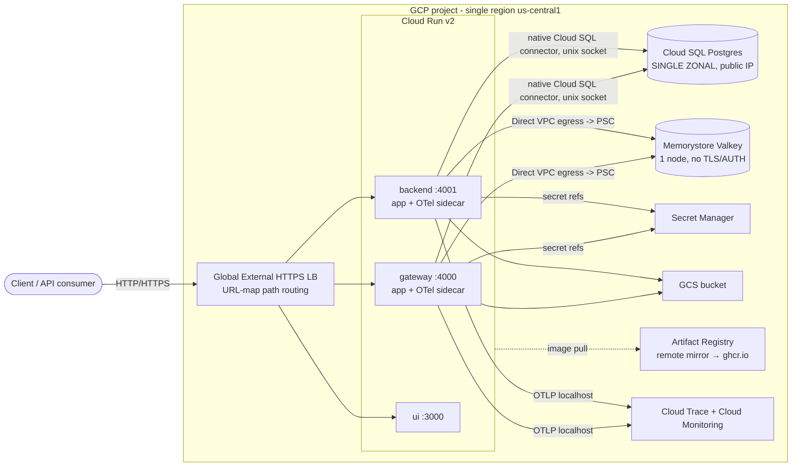
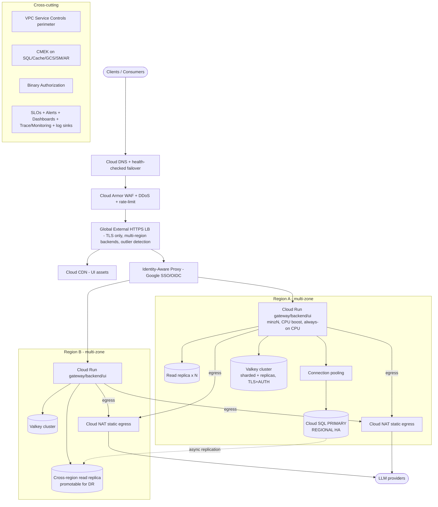
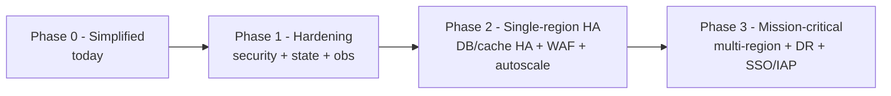

# Production-Readiness Roadmap — Resiliency & Scale

> How to evolve the **simplified** LiteLLM-on-GCP deployment (see
> [`DESIGN_DECISIONS.md`](./DESIGN_DECISIONS.md)) into a **high-resiliency,
> high-throughput, mission-critical** platform.
>
> This document describes *what* to change and *why*. It deliberately does not
> prescribe Terraform/config — that follows once the target is agreed.

---

## 1. TL;DR — posture shift

| Dimension | Simplified (today) | Mission-critical target |
|---|---|---|
| Regions | 1 region, 1 zone | ≥2 regions, multi-zone, active-active (or active-passive) |
| Cloud Run | `min=1`, throttled CPU, no boost | Warm pool `min≥N`, always-on CPU, startup CPU boost, gen2, per-workload concurrency |
| Postgres | Single **ZONAL** instance, public IP | **REGIONAL** HA + read replicas (in-region & cross-region), **private IP**, connection pooling, Enterprise Plus |
| Cache | Valkey 1 node, no TLS/auth | Sharded Valkey cluster, replicas per shard, multi-zone, **TLS + AUTH** |
| Edge | Global HTTPS LB, plaintext allowed, `allUsers` | LB + **Cloud Armor (WAF/DDoS/rate-limit)**, **Cloud CDN**, TLS-only, **IAP**, no `allUsers` |
| Identity | Master key + UI password | **Google-first SSO/OIDC**, IAP, virtual keys/teams/budgets, RBAC |
| Egress | Direct VPC egress, private-ranges only | **Cloud NAT static egress IPs**, egress firewall, provider allowlisting |
| Data protection | Google-managed keys | **CMEK** everywhere, **VPC-SC** perimeter, Binary Authorization |
| Observability | OTel → Trace/Monitoring (pipeline ready) | Full spans + **SLOs/alerts/dashboards**, log sinks, synthetics, cost guardrails |
| IaC/state | **Local state**, `local-exec` migration | **Remote state + locking**, CI/CD w/ WIF, policy gates, canary + rollback |
| DR | None (single point) | Defined **RTO/RPO**, cross-region replicas, tested failover runbooks |

---

## 2. Current (simplified) architecture



ASCII (single-region, single-zone; ⚠ = single point of failure):

```
                 ┌───────────────────────────────┐
   Client ──────▶│  Global External HTTPS LB      │  (plaintext allowed today)
                 │  path routing → serverless NEG │
                 └───────┬───────┬───────┬────────┘
                         │       │       │
                    ┌────▼──┐ ┌──▼───┐ ┌─▼────┐
                    │gateway│ │backend│ │  ui  │     Cloud Run (min=1, throttled CPU)
                    │+otel  │ │+otel │ │      │     ⚠ single region / single zone
                    └──┬─┬──┘ └──┬─┬─┘ └──────┘
        native CloudSQL │ │Direct VPC egress
        (unix socket)   │ │ (PSC)
                    ┌───▼─▼─────────┐   ┌──────────────┐
                    │ Cloud SQL PG  │   │  Valkey 1x    │
                    │ ⚠ ZONAL,      │   │  ⚠ no HA,     │
                    │   public IP   │   │   no TLS/AUTH │
                    └───────────────┘   └──────────────┘
```

**Failure modes today:** a zonal outage takes down Postgres and Valkey; a
regional outage takes down everything; DB has no read scaling and one write
node; cache has no failover; edge has no WAF/DDoS; UI is reachable by
`allUsers`; state is local (operator laptop).

---

## 3. Target (mission-critical) architecture



ASCII (multi-region, active-active):

```
                         Cloud DNS (failover)
                                │
                       Cloud Armor (WAF/DDoS/rate-limit)
                                │
                     Global HTTPS LB (TLS-only, IAP, CDN)
                    ┌───────────┴────────────┐
             ┌──────▼───────┐          ┌──────▼───────┐
             │  REGION A     │          │  REGION B     │
             │ Cloud Run     │          │ Cloud Run     │
             │ min≥N, boost  │          │ min≥N, boost  │
             │  │        │   │          │   │       │   │
             │  ▼        ▼   │          │   ▼       ▼   │
             │ pool→PG(HA)   │          │  PG read      │
             │  ├─read repl  │◀──async──┼─ replica(DR)  │
             │ Valkey cluster│  replication  Valkey     │
             │ Cloud NAT     │          │ Cloud NAT     │
             └──────┬────────┘          └──────┬────────┘
                    └────────► LLM providers ◀─┘
                        (static egress IPs)

  Cross-cutting: VPC-SC perimeter · CMEK · Binary Authorization ·
                 SLOs/alerts/dashboards · audit log sinks
```

---

## 4. Dimension-by-dimension roadmap

> Already implemented in the base module (gated, GCP-first): **Model Armor**
> guardrail (§4.5 safety) and a **Cloud Monitoring dashboard + alerts + uptime
> check** (§4.6). LLM-native `/metrics` → Managed Prometheus is enterprise-gated —
> see [`LIMITATIONS.md`](./LIMITATIONS.md).

Each item lists **Current → Target** and the concrete changes.

### 4.1 Compute — Cloud Run (throughput & tail latency)

- **Cold starts / warmth:** raise `min_instances` to cover baseline QPS per
  service; enable **startup CPU boost**; set **CPU always allocated** on the
  gateway (streaming + background callbacks keep working between requests).
- **Concurrency:** tune `max_instance_request_concurrency` per workload — LLM
  streaming pins a worker for tens of seconds, so keep gateway concurrency low
  and scale out on instances; static UI concurrency stays high.
- **Scale ceiling:** raise `max_instances`; request quota increases; size
  `uvicorn` workers to CPU.
- **Timeouts:** raise request timeout for long streaming responses (up to 60m).
- **Execution env:** pin gen2; consider committed-use for the warm floor.
- **Rollouts:** use Cloud Run **revision traffic splitting** for canary +
  instant rollback (see §4.7).
- **Multi-region:** run the service set in ≥2 regions behind the global LB.

### 4.2 Data — Cloud SQL for PostgreSQL

- **HA:** switch primary to **REGIONAL** (synchronous standby, automatic
  intra-region failover).
- **Read scale:** add **read replicas**; point LiteLLM read traffic at
  `DATABASE_URL_READ_REPLICA` (the upstream reference already models this).
- **DR:** add **cross-region read replica(s)**, promotable on regional loss;
  define RTO/RPO (see §6).
- **Private networking:** drop the public IP — use **private IP** (PSA or PSC).
  This removes the internet-facing endpoint entirely.
- **Connection management:** front the DB with **connection pooling** (Cloud SQL
  managed pooling / PgBouncer) — Cloud Run fan-out multiplies connections.
- **Tier/edition:** move to dedicated-core tier and **Enterprise Plus** (data
  cache, near-zero-downtime maintenance, higher connection limits).
- **Backups/PITR:** keep PITR; add **cross-region backups**; document + test a
  restore runbook; set maintenance windows + deny periods.
- **Very high scale option:** evaluate **AlloyDB for PostgreSQL** (columnar
  cache, better read fan-out) as a drop-in-ish upgrade.
- **Auth:** LiteLLM uses password auth; add **Secret Manager rotation** and CMEK.

### 4.3 Cache — Memorystore for Valkey

- **HA:** `replica_count ≥ 1` per shard + **multi-zone** distribution →
  automatic failover.
- **Throughput:** `shard_count > 1` (cluster mode) and a larger `node_type`
  (STANDARD/HIGHMEM) sized to ops/sec and memory working set.
- **Security:** enable **transit encryption (SERVER_AUTHENTICATION)** and
  **AUTH** (today both are off on the private path for simplicity).
- **Ops:** maintenance policy; alert on hit-rate, evictions, memory, CPU,
  failovers. Cache is regional → one cluster per region for DR.
- **Why it matters at scale:** LiteLLM uses the cache for cross-instance rate
  limiting, response caching, and router cooldown/state — it becomes hot as
  Cloud Run scales out.

### 4.4 Networking & ingress

- **WAF/DDoS:** attach **Cloud Armor** to the LB backends — managed OWASP rules,
  **rate limiting**, geo/IP allow-deny, bot management, and **DDoS protection
  (Advanced)** for mission-critical.
- **TLS:** make TLS mandatory (drop `allow_plaintext_lb`), managed certs,
  **SSL policy** pinning min TLS 1.2 + modern ciphers.
- **CDN:** enable **Cloud CDN** on the UI backend for static assets.
- **Egress control:** for calling external LLM providers, route egress through
  **Cloud NAT with reserved static IPs** (providers can allowlist you) and apply
  **egress firewall** rules + logging. (Changes Cloud Run egress from
  private-ranges-only to all-traffic-via-VPC.)
- **Multi-region backends** on the global LB with **outlier detection** and
  health-based failover; **Cloud DNS** health-checked routing on top.
- **Private posture:** Private Google Access; keep data-plane services
  `INGRESS_TRAFFIC_INTERNAL_LOAD_BALANCER`.

### 4.5 Security & identity  *(Google-first)*

**Identity / SSO (the headline ask):**
- **Admin UI login via Google SSO/OIDC** — configure LiteLLM SSO against
  **Google Workspace / Cloud Identity (OIDC)**; map **Google Groups → LiteLLM
  roles** (RBAC). LiteLLM Enterprise supports SSO + SCIM-style group mapping.
- **Identity-Aware Proxy (IAP)** in front of the UI/admin endpoints as
  defense-in-depth: only Google-authenticated principals with the right IAM
  binding reach the service. This **replaces the `allUsers` invoker** on the UI
  (and optionally the API) with real identity.
- **API consumers:** use LiteLLM **virtual keys, teams, and budgets** for
  per-tenant RBAC, quotas, and spend caps instead of a single master key.

**Data protection & guardrails:**
- **CMEK** (customer-managed keys) on Cloud SQL, Memorystore, GCS, Secret
  Manager, and Artifact Registry.
- **VPC Service Controls** perimeter around the project to block data
  exfiltration to non-perimeter Google APIs.
- **Binary Authorization** — only signed/attested images deploy (pairs with the
  Artifact Registry supply chain).
- **Org policies:** restrict `allUsers`/`allAuthenticatedUsers`, domain-
  restricted sharing, require CMEK, forbid public IP on Cloud SQL, restrict
  regions.
- **Least privilege:** split gateway vs backend into **separate runtime SAs**
  (today they share one); keep the zero-permission UI SA; scope secret access
  per-service.
- **Supply chain / CI:** **Workload Identity Federation** (no SA keys),
  vulnerability scanning on the mirror/registry, SBOM.
- **Audit:** enable **Data Access audit logs**, export via **log sink** to
  BigQuery/SIEM; alert on IAM and secret access anomalies.
- **Sensitive content:** keep `OTEL_..._CAPTURE_MESSAGE_CONTENT=no_content`
  (default); if enabling, add DLP review of the observability path.

### 4.6 Observability & operations

- **Close the OTEL gap** (current open item): LiteLLM isn't emitting spans in
  the `-dev` image — resolve so traces populate Cloud Trace end-to-end.
- **SLOs & error budgets** (availability, p95/p99 latency, error rate) with
  Cloud Monitoring; **alerting policies** on latency, errors, saturation, DB
  connections/replication lag, cache evictions, and **cost/budget**.
- **Dashboards** per service + golden signals; **uptime/synthetic checks**.
- **LiteLLM metrics:** scrape `/metrics` into **Managed Service for Prometheus**.
- **Logs:** structured logging, **log sinks** to BigQuery, retention policy.
- **Runbooks + on-call:** incident response, failover, restore, and rotation
  runbooks.

### 4.7 IaC, state & delivery

- **Remote state:** move from **local state** to a **versioned GCS backend with
  locking** — this is a hard prerequisite for team/prod use.
- **CI/CD:** pipeline (Cloud Build / GitHub Actions) with **WIF**, `plan` on PR,
  `apply` on merge; **policy gates** (OPA/Conftest, tfsec/Checkov) and
  `terraform test` in CI.
- **Migrations:** run the migration job from the **pipeline** (Cloud Build step
  / triggered Cloud Run Job), not the current `local-exec` that depends on
  `gcloud` on the operator's machine.
- **Progressive delivery:** Cloud Run **canary via traffic tags**, automated
  rollback on SLO breach; **drift detection**.
- **Multi-tenant module:** version the module; per-customer/per-env configs
  (workspaces or dirs) reusing the same module.

### 4.8 Multi-region & disaster recovery

- **Topology:** active-active (both regions serve) or active-passive (warm
  standby). Global LB already provides anycast; add **regional backends**.
- **Data:** Cloud SQL **cross-region read replica** (promote on failover);
  per-region Valkey; **dual/multi-region GCS**; multi-region Artifact Registry;
  Secret Manager replication.
- **Failover:** health-based LB failover + DNS; documented, **tested** promotion
  runbook.
- **Targets:** define and validate **RTO/RPO** (see §6).

---

## 5. Phased roadmap



| Phase | Theme | Key changes | Outcome |
|---|---|---|---|
| **1** | Hardening | Remote TF state + locking; CI/CD + WIF; private IP DB; drop plaintext LB + `allUsers`; Cloud Armor baseline; CMEK; split SAs; close OTEL gap; SLOs/alerts | Safe to operate as a team; no obvious foot-guns |
| **2** | Single-region HA & scale | Cloud SQL REGIONAL + read replica + pooling; Valkey cluster + replicas + TLS/AUTH; Cloud Run warm pool + CPU boost + concurrency tuning; CDN; Google SSO/IAP | Survives a **zone** failure; handles high throughput |
| **3** | Mission-critical / multi-region | 2nd region active-active; cross-region DB replica + tested failover; VPC-SC; Binary Authorization; DDoS Advanced; canary + auto-rollback; DR drills | Survives a **region** failure; meets strict RTO/RPO |

---

## 6. RTO / RPO targets (illustrative — set with stakeholders)

| Scenario | Simplified today | Phase 2 (HA) | Phase 3 (multi-region) |
|---|---|---|---|
| Zone failure | Full outage | **Auto-failover < 1–2 min** (SQL HA, Valkey replica) | Transparent |
| Region failure | Full outage, manual rebuild | Full outage | **RTO minutes** (promote replica, DNS/LB failover) |
| Data loss (RPO) | Last backup / PITR | PITR seconds–minutes | Cross-region async lag (seconds–minutes) |
| Accidental delete | Deletion protection tripwire | + tested restore runbook | + cross-region backups |

---

## 7. Security controls checklist (Google-first)

- [ ] Google Workspace/Cloud Identity **OIDC SSO** for the admin UI (groups→roles)
- [ ] **IAP** in front of UI/admin; remove `allUsers`
- [ ] LiteLLM **virtual keys / teams / budgets** for API RBAC + spend caps
- [ ] **Private IP** Cloud SQL; no public endpoints anywhere
- [ ] **Cloud Armor** WAF + rate limiting + DDoS; **TLS-only** + SSL policy
- [ ] **Cloud NAT** static egress + egress firewall + provider allowlist
- [ ] **CMEK** on SQL, Memorystore, GCS, Secret Manager, Artifact Registry
- [ ] **VPC Service Controls** perimeter
- [ ] **Binary Authorization** + image vuln scanning + SBOM
- [ ] **Org policies:** restrict public sharing/IP, require CMEK, region locks
- [ ] **Separate least-privilege SAs** per service; secret rotation
- [ ] **WIF** for CI/CD (no SA keys)
- [ ] **Data Access audit logs** → SIEM/BigQuery sink + alerting
- [ ] Secrets never in TF state; **remote state** encrypted + access-controlled

---

## 8. Cost & complexity note

Each resiliency lever adds cost: warm Cloud Run pools, REGIONAL DB + replicas,
Valkey clusters, a second region, Cloud Armor/CDN, and DDoS Advanced are the big
line items. Right-size per SLO — not every workload needs Phase 3. The phased
plan lets spend track the actual availability/throughput requirement.

---

## 9. Open items carried from the current build

- **LiteLLM OTEL emission** — collector + GCP export verified healthy, but the
  `litellm-gateway:v1.86.0-dev` image emits no spans. Resolve (stable tag /
  standard OTel SDK env vars / non-split image) as part of Phase 1 observability.

See [`DESIGN_DECISIONS.md`](./DESIGN_DECISIONS.md) for why each current choice was
made and its explicit production upgrade path.
